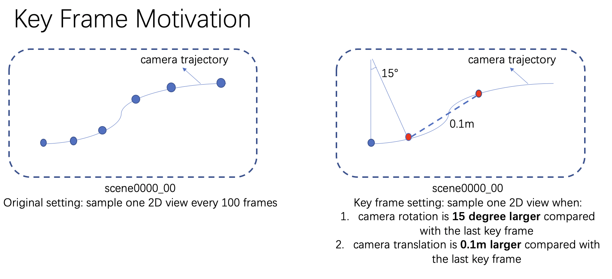
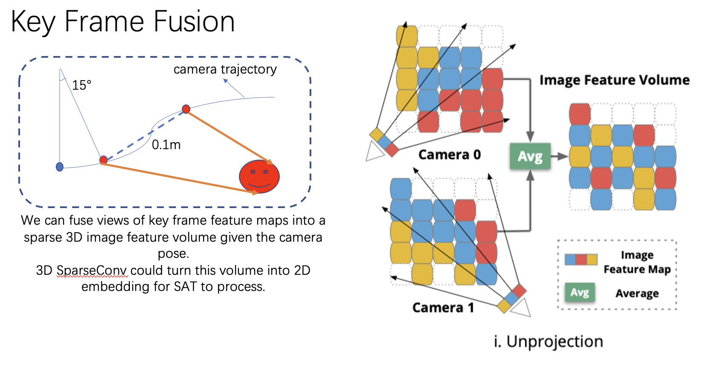

# SAT-Advanced
This is an advanced SAT implementation built upon [Zhengyuan](https://zyang-ur.github.io/)'s codebase [SAT](https://github.com/zyang-ur/SAT). 

As of 8th Jul 2022, this implementation ranks 2nd in [referit3d](https://referit3d.github.io/benchmarks.html) benchmarks with an overall ref-acc metric of `52.3%`.

## What is SAT?

In short, SAT focuses fusing 2D semantics into 3D visual grounding. It was accepted by the IEEE International Conference on Computer Vision 2021 (ICCV'21) as oral presentation. 

## What parts have you modified to boost SAT?

1. Key Frame Selection

   

   Refer to `in_out/pose_solver.py` and `in_out/pose_solver_filter.py` to see how to generate key frames for the dataset.

   Key frame selection reduced the similarity of adjacent sampling views (cases when the camera move slowly or holds steady), allowing maximum efficiency in 2D-3D correspondence learning. 

2. Frozen BERT

   Experiments show that freezing the BERT language encoder in the training process of SAT contributes slightly to the final performance. I assume language learning will disturb learning of other SAT parts.

3. Pre-trained 3D Object Encoder

   Pre-training the PointNet2 encoder on ShapeNet dataset will contribute significantly to the final performance. See `pretrain_pnet2/train_classification.py` for details.

4. (Failed Trial) Bringing in CLIP Encoder

5. (TODO) 3D SparseConv Unprojection

6. 


## Run 

Please configure the running environment as [the original SAT](https://github.com/zyang-ur/SAT#installation) tells.

The first 300 lines of `main.py` contains all trial running commands of SAT-Advanced. To reproduce the best one, run:

```bash
CUDA_VISIBLE_DEVICES=1 python main.py --init-lr 0.0002 --batch-size=36 --gpu=1 --transformer --experiment-tag=add_key_frame_frozen_pretrained_pnet \
--model mmt_referIt3DNet -scannet-file /data/meta-ScanNet/pkl_nr3d/keep_all_points_00_view_with_global_scan_alignment/keep_all_points_00_view_with_global_scan_alignment.pkl \
-offline-2d-feat /data/meta-ScanNet/split_feat/ \
--use-clip-language --offline-language-type bert --offline-language-path /data/meta-ScanNet/nr3d_bert_text/ \
-referit3D-file /data/meta-ScanNet/nr3d.csv --log-dir /data/logs/ --unit-sphere-norm True \
--feat2d CLIP --clsvec2d --context_2d unaligned --mmt_mask train2d \
--save-args --norm-visual-feat --n-workers 8 --direct-eos --add-lang-proj --git-commit --key_frame_choice clip_add \
--load-pretrained-obj-encoder /home/xiaozilin/CLIP-Transfer/log/classification/2021-12-06_19-21/checkpoints/best_model.pth
```


## Performance

| Exp Name                                   | Ref acc on Nr3D                                              |
| ------------------------------------------ | ------------------------------------------------------------ |
| SAT baseline                               | 0.467 (@epoch 62) [discussion of lower metric than paper reported?](https://github.com/zyang-ur/SAT/issues/1) |
| +key_frame                                 | 0.495 (@epoch 95)                                            |
| +key_frame + frozen_bert                   | 0.508 (@epoch 93)                                            |
| +key_frame + frozen_bert + pretrained_pnet | **0.523 (@epoch 99)**                                        |

Note that SAT baseline can't be reproduced, partially because the PointNet2 implementation SAT used highly depends on hardware, according to SAT authors.

## Citation

```
@inproceedings{yang2021sat,
  title={Sat: 2d semantics assisted training for 3d visual grounding},
  author={Yang, Zhengyuan and Zhang, Songyang and Wang, Liwei and Luo, Jiebo},
  booktitle={Proceedings of the IEEE/CVF International Conference on Computer Vision},
  pages={1856--1866},
  year={2021}
}
```
